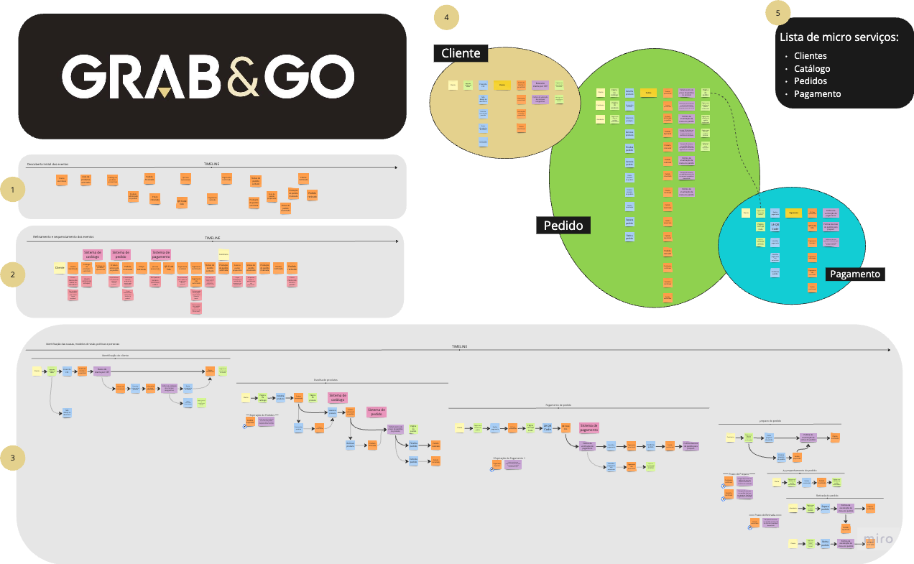
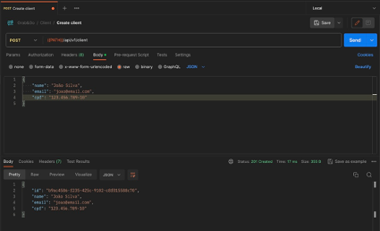
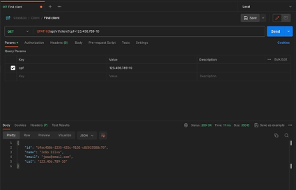
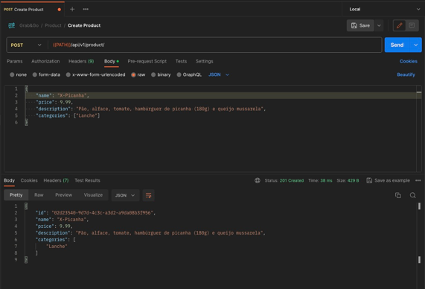
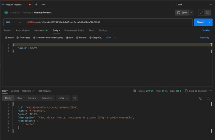
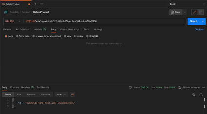
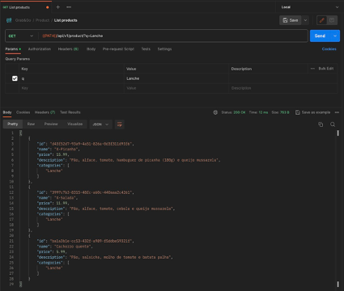
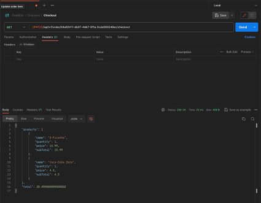
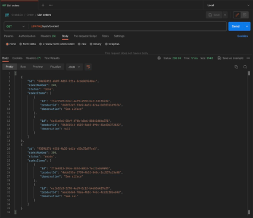

# Grab&Go

___

Essa aplicação é um projeto de estudo para o curso de pós-graduação em Arquitetura de Software da FIAP.

O objetivo é criar uma aplicação que simule um sistema de pedidos de uma rede de _fast-food_, utilizando DDD, organização em containers e arquitetura hexagonal.

Nesse sistema foram utilizados NodeJS e NestJS para o desenvolvimento da API, e PostgreSQL como banco de dados.

___



Miro: https://miro.com/welcomeonboard/SVdxc1dwQjZBVGI1bGxYRDJjSndNdnlxZ2ZJOXVOMlVTTWF0ZThlcUZRbEh0UDlNc2RwbVdrVklJWEt3RG80Q3wzMDc0NDU3MzYwMDIzOTExMTc1fDI=?share_link_id=553122589040

## Glossário

- Catálogo: Conjunto de produtos disponíveis para serem adicionados em pedidos.
- Cliente: Usuário que solicita o pedido, podendo ser identificado com nome, CPF, e-mail.
- Cozinheiro: Usuário responsável por preparar e entregar um pedido.
- Pedido: Solicitação de preparo e entrega de produtos, vinculado a um pagamento, podendo estar vinculado a um cliente. Possui um status de acompanhamento.
- Status de acompanhamento: Indicação do estado de um pedido, podendo ser "Realizado", "Na fila", "Expirado", "Em preparo", "Cancelado", "Pronto", "Aguardando Retirada", "Descartado" e "Entregue"

___

## Instalação e execução

### Docker

i. Execute o comando abaixo para criar as imagens e executar os containers da aplicação e do banco de dados no ambiente de desenvolvimento:
```bash
$ docker-compose up -d db app
```

ii. Acesse a aplicação em http://localhost:3000

### Local

i. Instale as dependências:
```bash
$ npm install
```

ii. Crie um arquivo `.env` na raiz do projeto, com base no arquivo `.env.example`, e preencha as variáveis de ambiente.

iii. Execute o comando abaixo para executar as migrations no banco de dados do ambiente de desenvolvimento:
```bash
$ npx prisma migrate dev
```

iv. Execute o comando abaixo para popular o banco de dados:
```bash
$ npm run prisma:seed
```

v. Execute o comando abaixo para iniciar a aplicação no ambiente de desenvolvimento:
```bash
$ npm run start:dev
```

vi. Acesse a aplicação em http://localhost:3000

## Scripts

_i. Executar migrations no banco de dados do ambiente de desenvolvimento:_
```bash 
$ npx prisma migrate dev
```

_ii. Executar migrations no banco de dados dos ambientes de staging ou produção:_
```bash
$ npx prisma migrate deploy
```

_iii. Popular banco de dados:_
```bash
$ npm run prisma:seed
```

_iv. Executar o sistema no ambiente de desenvolvimento:_
```bash
$ npm run start:dev
```

_v. Preparar ambiente para teste de integração:_
```bash
$ npm run pretest:e2e
```

_vi. Executar testes de integração:_
```bash
$ npm run test:e2e
```

## Postman

Arquivos disponíveis para importação: [.docs/postman](./docs/postman)
- [Collection](./docs/postman/Grab&Go.postman_collection.json)
- [Local environment](./docs/postman/Local.postman_environment.json)

## Documentação

Disponível via Swagger: http://localhost:3000/api/v1/docs

___

## Fluxo de eventos:

1.	Cadastro de cliente



2. Identificação do cliente via CPF



3.	Criar, editar e remover produto

        a.	Criar produto

        

        b. Editar produto

        

        c. Remover produto
        
        


4.  Buscar produtos por categoria



5.	Fake checkout



6.	Listar os pedidos



___
### Desenvolvido pelo grupo 41
- Thiago Pinheiro Silva
- José Benicio de Paiva Toni
- Felipe Pereira da Silva